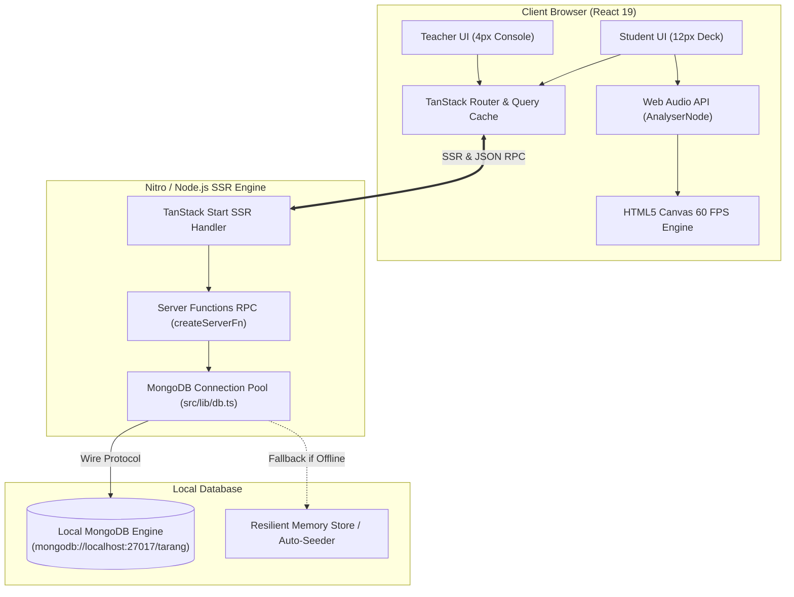

# System Architecture & Data Flow — Tarang

## 1. High-Level Architectural Diagram



---

## 2. Client-Server Lifecycle & Data Flow

### 2.1 Route Loading & Server-Side Rendering

1. **Request Intake**: User navigates to `/dashboard` or `/practice`.
2. **SSR Execution**: TanStack Start initializes `QueryClient`, invokes route loaders via Server Functions, and fetches batch or module data from MongoDB via `getDb()`.
3. **Hydration**: HTML is streamed to client with pre-rendered data; React 19 hydrates the DOM seamlessly without layout shifts.

### 2.2 Audio Recording & Live Visualization Flow

```text
Microphone Input
       │
       ▼
getUserMedia() Stream
       │
       ▼
AudioContext.createMediaStreamSource()
       │
       ▼
AnalyserNode (fftSize: 256, smoothingTimeConstant: 0.8)
       │
       ▼
requestAnimationFrame Loop (60 FPS)
       │
       ▼
Canvas 2D Rendering (Adaptive Teal Bar Intensity)
       │
       ▼
User Stops Recording ──► Compute Segments (Clear / Pause / Filler) ──► Save Attempt
```

### 2.3 Attempt Submission & Persistence Flow

1. Student clicks **Stop & Analyze** on `/practice/:moduleId`.
2. Client generates waveform segments, computes duration, filler word occurrences, and pause intervals.
3. Client dispatches `createAttempt` server function.
4. Server function inserts document into `attempts` collection in MongoDB and updates the student's `lastActive`, `scorePct`, and `trendPct` in the `students` collection.
5. TanStack Query invalidates `["attempts"]` and `["studentRoster"]` cache keys, updating the Teacher Dashboard in real time.

---

## 3. Local MongoDB Connection Strategy

### Connection Caching Pattern

In development environments with Vite HMR, multiple module re-evaluations can exhaust database sockets. The database connection manager uses a global socket cache:

```typescript
declare global {
  var _mongoClientPromise: Promise<MongoClient> | undefined;
}
```

This guarantees a persistent connection pool of up to 10 sockets across hot reloads.
